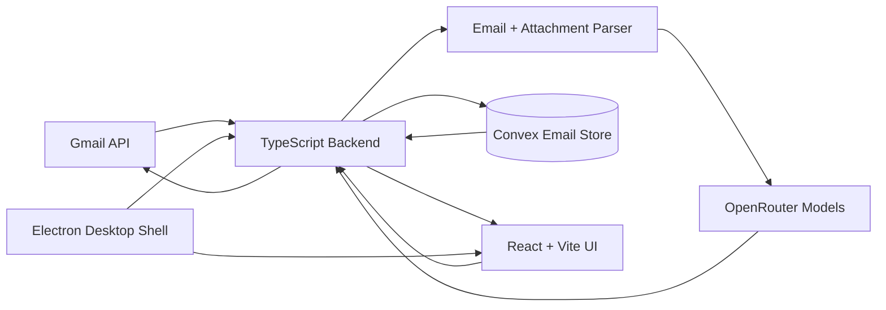

<div align="center">

# MailMe

### A polished desktop email co-pilot for turning unread Gmail into clear summaries, ready-to-edit replies, and a persistent follow-up workflow.

[](https://www.electronjs.org/)
[](https://react.dev/)
[](https://www.typescriptlang.org/)
[](https://vite.dev/)
[](https://convex.dev/)
[](https://developers.google.com/gmail/api)
[](https://openrouter.ai/)
[](LICENSE.txt)

</div>

---

## What is MailMe?

MailMe is a desktop-first email assistant built for people who want to process inboxes quickly without losing control over the final response. It connects to Gmail, reads unread inbox messages, summarizes the important context, generates a suggested reply, and saves the work in a durable Convex-backed email workflow.

The app is designed around a calm triage loop:

1. **Fetch unread Gmail** from a native desktop app.
2. **Summarize each message** with sender, subject, body, and supported attachment text.
3. **Generate a draft reply** that can be edited before sending.
4. **Save draft state** so work survives reloads and future sessions.
5. **Send replies through Gmail** while preserving sent status and response metadata.

---

## Highlights

### AI-assisted inbox triage

- Summarizes unread Gmail messages into concise, actionable briefs.
- Generates reply drafts for each processed email.
- Includes readable attachment text in the AI context when available.
- Streams progress while messages are being processed so the interface stays responsive.

### Human-in-the-loop reply workflow

- Generated replies are editable before they are sent.
- Saved draft updates are persisted and reloaded later.
- Sent, draft-updated, failed-send, and generated states are tracked as part of the record.
- Replies are sent through the Gmail API instead of being treated as throwaway local text.

### Persistent email memory

- Convex stores summaries, generated replies, draft edits, send state, timestamps, and Gmail responses.
- Records are indexed by Gmail message ID to avoid duplicate workflow entries.
- Recent emails can be listed across sessions, not only during the current sync.

### Desktop-native app shell

- Electron wraps the app as a cross-platform desktop experience.
- The local TypeScript backend is owned by the Electron lifecycle to avoid duplicate server processes.
- The frontend is bundled with Vite and served from the local backend for the desktop runtime.

### Refined product interface

- React and Tailwind CSS power a focused mailbox-style layout.
- Sidebar navigation separates current sync, all saved emails, and drafts.
- Search filters subjects, senders, summaries, and draft text.
- Local caching keeps previously loaded records visible while the backend refreshes.
- Framer Motion, Lucide icons, and custom CSS variables give the UI a polished productivity-app feel.

---

## Product Design

MailMe is intentionally designed as an **email review desk**, not a chat window glued onto an inbox.

| Area | Design intent |
| --- | --- |
| **Sidebar** | Keeps mailbox modes clear: current sync, all saved messages, and drafts. |
| **Message list** | Prioritizes scanning with sender identity, subject, status, and recent context. |
| **Reading pane** | Shows the AI summary and source context in a workspace suitable for review. |
| **Draft editor** | Treats AI output as a starting point, giving the user final control before send. |
| **Sync feedback** | Streams server-sent events during processing instead of leaving users guessing. |
| **Persistence** | Saves the workflow state so triage can happen across multiple sessions. |

The visual system uses dark productivity-app surfaces, restrained borders, accent colors for status, compact spacing, and readable content panes to support sustained inbox work.

---

## Core Features

- **Unread Gmail sync** — fetches unread inbox messages and marks them processed after retrieval.
- **AI summaries** — generates concise summaries from message body and extracted attachment text.
- **AI reply drafts** — creates suggested responses for each email.
- **Draft editing** — lets users revise AI-generated replies in the app.
- **Draft persistence** — saves edited drafts to Convex.
- **Reply sending** — sends replies through Gmail with normalized `Re:` subjects.
- **Status tracking** — records generated, draft-updated, sent, and send-failed states.
- **Saved email history** — lists recent persisted summaries beyond the current fetch session.
- **Drafts view** — focuses only on messages with saved reply text.
- **Search** — filters across sender, subject, summary, and draft reply text.
- **Auto-refresh cadence** — keeps a countdown for the next mailbox fetch.
- **Local cache** — stores loaded email records in browser storage for a faster-feeling UI.

---

## Tech Stack

### Application shell

- **Electron** — desktop runtime and app packaging.
- **Node.js HTTP server** — local backend for API routes, server-sent events, and static frontend assets.
- **TypeScript** — shared language across backend and frontend code.

### Frontend

- **React 19** — interactive mailbox, draft editor, and stateful UI.
- **Vite** — fast frontend development and production build pipeline.
- **Tailwind CSS** — utility styling for layout and responsive UI.
- **Framer Motion** — motion primitives for a more expressive interface.
- **Lucide React** — icon system.
- **React Router** — app navigation and view parameters.
- **React Markdown** — summary and rich text rendering.
- **date-fns** — date and timestamp formatting.

### Backend and data

- **Gmail API / googleapis** — OAuth, unread email retrieval, message label updates, and reply sending.
- **OpenRouter** — AI provider gateway for text generation and optional model configuration.
- **Convex** — persistent reactive backend for email summaries, draft replies, status, and send metadata.
- **pdf-parse** — readable PDF attachment extraction for AI context.
- **dotenv** — local configuration loading.

---

## Architecture at a Glance



### Main runtime responsibilities

- **Electron** starts and owns the backend process, then displays the local frontend.
- **Backend server** exposes the email APIs, streams fetch progress, serves the built UI, and coordinates Gmail, OpenRouter, and Convex.
- **Gmail integration** handles OAuth, unread inbox fetches, message label updates, attachment retrieval, and reply sends.
- **LLM layer** creates summaries and reply drafts through OpenRouter.
- **Convex store** upserts email workflow records and tracks draft/send state.
- **React UI** renders mailbox views, summaries, draft editing, status, search, and cached records.

---

## Repository Map

```text
MailMe/
├─ backend/                 # Local TypeScript server and integrations
│  ├─ server.ts             # API routes, static serving, and SSE fetch stream
│  ├─ services.ts           # Gmail → AI → Convex workflow orchestration
│  ├─ gmail.ts              # Gmail OAuth, fetch, attachment, and reply helpers
│  ├─ llm.ts                # Summary and reply generation
│  ├─ convexStore.ts        # Convex client access from the local backend
│  └─ emailParser.ts        # Message body, sender, and attachment parsing
├─ convex/                  # Convex schema, auth guard, queries, and mutations
├─ gui/                     # React + Vite frontend
│  └─ src/
│     ├─ pages/             # Product screens
│     ├─ components/        # Reusable UI pieces
│     └─ assets/            # Visual assets
├─ electron.js              # Desktop shell entry point
├─ start.js                 # Electron launcher
├─ static/dist/             # Built frontend output
└─ resources/               # Desktop packaging assets
```

---

## Configuration Overview

MailMe expects local configuration for the services it talks to:

- **Gmail OAuth credentials** in `secrets/credentials.json`.
- **OpenRouter settings** through `OPENROUTER_*` environment variables.
- **Convex deployment URL and app secret** for persisted email workflow state.
- **Optional app settings** such as local host, port, and fetch limits.

See `.env.example` in the repository for the exact variable names supported by the app.

---

## Development Commands

This README is product-focused, but contributors will usually need these commands:

```bash
npm install          # install root and desktop/backend dependencies
npm run dev          # run Electron, backend, and frontend in development mode
npm run frontend     # run only the Vite frontend dev server
npm run build:frontend
npm run typecheck
npm run dist         # package desktop builds with electron-builder
```

---

## Privacy and Data Notes

MailMe processes mailbox content locally through its desktop backend, but the workflow intentionally connects to external services:

- Gmail provides email content and sends replies.
- OpenRouter receives the prompt content needed to create summaries and replies.
- Convex stores the generated summaries, draft replies, timestamps, and send status.

Review provider policies and your model configuration before using the app with sensitive inboxes.

---

## License

MailMe is released under the [MIT License](LICENSE.txt).
